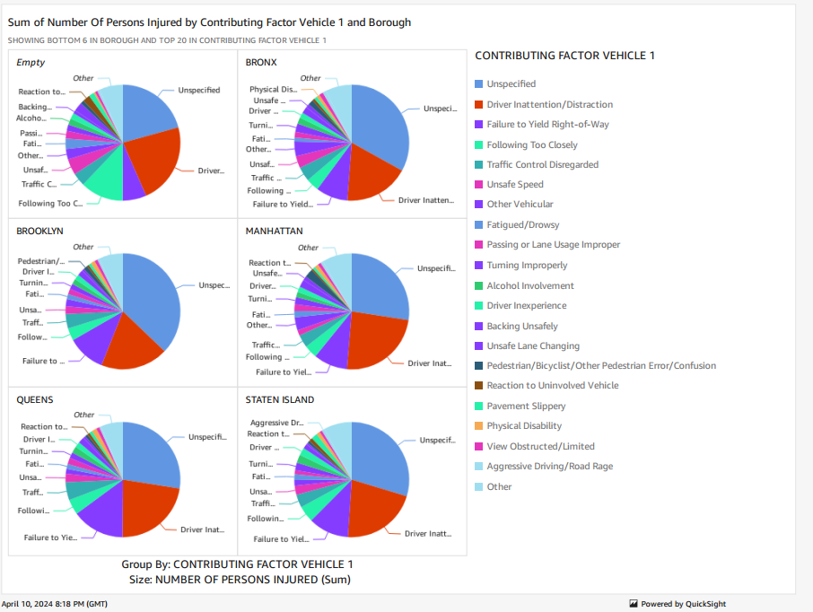

# Data Visualization

These are the steps that I took in order to create a static website and host it using Amazon S3 and Amazon Quicksight. I am using the data set provided in the "Step #1" section below, that provides information about Motor Vehicle Collisions in NYC.

## Step #1: Download the Dataset
This is the dataset that I had used for this project.
[Motor Vehicle Collisions - Crashes Data Set](https://catalog.data.gov/dataset/motor-vehicle-collisions-crashes)

## Step #2: Store Dataset in Amazon S3
[Amazon S3 Documentation](https://docs.aws.amazon.com/s3/)
[Introduction to Amazon Simple Storage Service Cloud Storage](https://www.youtube.com/watch?v=77lMCiiMilo&ab_channel=AmazonWebServices)

## Step #3: Connect S3 Bucket with Amazon Quicksight
[Amazon Quicksight Documentation](https://docs.aws.amazon.com/quicksight/)
[Amazon QuickSight - Overview](https://www.youtube.com/watch?v=_gGFYq9WKbk&ab_channel=AmazonQuickSight)

## Result

## Resources
 - [Build with Me: Visualize Data using Amazon QuickSight] ([Link to Tutorial](https://www.youtube.com/watch?v=4-8cXuZzKTg&list=PLWBfjpfzscb7rCHCeZHZgm5PgifCZdr1M&index=7&ab_channel=TechWithLucy))
